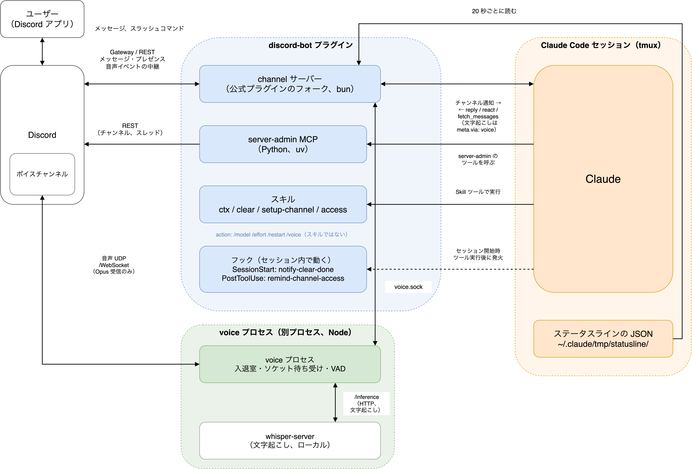

# Claude Code 用 Discord Bot プラグイン（discord-bot）

*A Claude Code plugin that turns a Discord bot into a remote front-end for a Claude Code session: check context usage and clear the session from Discord, show usage in the bot's status, manage server channels, and run skills via slash commands. Forked from the official Discord channel plugin. Documentation is in Japanese.*

開発者が運用している Discord サーバー管理 Bot「kuroko-chan」の中身です。Claude Code のプラグインとして動きます。Discord 社および Anthropic 社とは無関係の、非公式なコミュニティ製プラグインです。

Claude Code の channel 機能（`claude --channels ...`）で Discord のメッセージを会話に流し込むとき、公式の Discord プラグインが担当するのはメッセージの送受信だけです。このプラグインは公式プラグインの channel サーバーをフォークして土台にし、その上にセッション管理（`/ctx` `/clear` `/restart` `/model` `/effort`）、サーバー管理、Bot ステータス表示、音声入力を載せたものです。作った経緯と考え方は [docs/background.md](docs/background.md) にあります。



## 機能

| 機能 | Discord での操作 |
| --- | --- |
| メッセージの送受信 | 公式プラグインからフォークした channel サーバー（`channel/`）。アクセス管理は `/discord-bot:access` |
| コンテキストの表示とクリア | `/ctx` で ctx / 5h / 7d の使用率、`/clear` でセッションをクリア |
| 再起動とモデル切り替え | `/restart`（`claude update` を挟む）、`/model alias:sonnet`、`/effort level:low` |
| Bot ステータスに使用量を表示 | アクティビティを `ctx 53% · 5h 46% · 7d 17%` に常時更新（ctx 80% 以上で赤） |
| サーバー管理 | チャンネル・カテゴリ・フォーラムスレッドの作成・編集・削除・一覧（`server-admin` MCP、9 ツール）。`/discord-bot:setup-channel` で作成から受信テストまで |
| スラッシュコマンドの追加 | `~/.claude/discord-bot/commands.json` に書けば任意のスキルを引数付きで呼べる |
| 音声入力（聞き取りのみ） | `/voice join`・`leave`・`status`。発話を whisper.cpp でローカル文字起こしし、テキストチャットに返す |

使い方の詳細と返事の例は [docs/usage.md](docs/usage.md) にあります。

## セットアップ

必要なものは tmux、uv、bun と Discord の Bot です。Bot は Message Content Intent を有効にし、`bot` と `applications.commands` の2 つのスコープでサーバーに招待してください（Bot の作り方は `channel/UPSTREAM-README.md` の Quick Setup 1〜3 と同じです）。動作確認は macOS で行っています。

1. プラグインを入れる。公式の Discord プラグインを使っていた場合は無効にしてください（同じトークンで Gateway 接続が 2 本になり、返信が二重になります）

   ```sh
   claude plugin marketplace add umitsu-tech/claude-plugins
   cd <Discord セッションに使うプロジェクト>
   claude plugin install discord-bot@ryuki-plugins --scope project
   ```

2. Bot トークンを保存する。公式プラグインで設定済みならそのまま使えます

   ```
   /discord-bot:configure <トークン>
   ```

3. ステータスラインの JSON を保存する。`settings.json` の `statusLine.command` をラッパー経由にします

   ```json
   { "statusLine": { "type": "command", "command": "uv run ~/path/to/claude-code-discord-bot/scripts/statusline_dump.py -- <元のコマンド>" } }
   ```

4. channel プラグインとして承認する。Claude Code は公式以外の channel プラグインからの通知を既定で捨てるため、管理者設定 `/Library/Application Support/ClaudeCode/managed-settings.json`（macOS、要 sudo）に次を書きます

   ```json
   { "allowedChannelPlugins": [ { "plugin": "discord-bot", "marketplace": "ryuki-plugins" }, { "plugin": "discord", "marketplace": "claude-plugins-official" } ] }
   ```

   承認しない場合は `DISCORD_BOT_CHANNEL_MODE=official` で起動すると公式プラグインが送受信を担当します（スラッシュコマンドは使えません）。

5. 起動する。tmux セッション `discord` の中で claude が動きます。初回は DM に届くペアリングコードを `/discord-bot:access pair <コード>` で承認してください

   ```sh
   ~/path/to/claude-code-discord-bot/scripts/start-discord.sh                       # 新規
   ~/path/to/claude-code-discord-bot/scripts/start-discord.sh --resume <session-id> # 会話を引き継ぐ
   ```

   起動画面に「messages from plugin:discord-bot@ryuki-plugins inject directly in this session」と出て、「not on the approved channels allowlist」の行が無ければ届く状態です。

6. 音声入力を使う場合（任意）。Node.js 22.12 以上と whisper.cpp が必要です。`scripts/setup-voice.sh` が導入とモデルのダウンロードを一度に行います。ボイスチャンネル側の準備は [docs/usage.md](docs/usage.md) の /voice の節を見てください

## ドキュメント

| ファイル | 区分 | 内容 |
| --- | --- | --- |
| [docs/usage.md](docs/usage.md) | 説明 | Discord での使い方と返事の例 |
| [docs/how-it-works.md](docs/how-it-works.md) | 説明 | /clear・/model・/restart・音声の流れ、サーバー管理 MCP、制約 |
| [docs/background.md](docs/background.md) | 説明 | 背景と考え方、関連記事 |
| [docs/development.md](docs/development.md) | 手順 | 更新のしかた、ディレクトリ構成、voice の導入・動作確認 |
| [docs/verify/voice.md](docs/verify/voice.md) | 手順 | 音声機能の通し検証手順 |
| [docs/verify/0.7.1.md](docs/verify/0.7.1.md) | 手順 | /model・/effort・/restart の実機確認手順 |
| [docs/changelog.md](docs/changelog.md) | 記録 | 版ごとの変更履歴 |
| [docs/archive/migration-plan.md](docs/archive/migration-plan.md) | 記録 | 2026-09-03 の移植手順書 |

## ライセンス

MIT License です。ただし `channel/` は公式 Discord プラグイン（`anthropics/claude-plugins-official`、Apache-2.0）のフォークなので、そのディレクトリは Apache-2.0 のままです（`channel/LICENSE`）。改変した内容は `channel/server.ts` の先頭に書いてあります。
