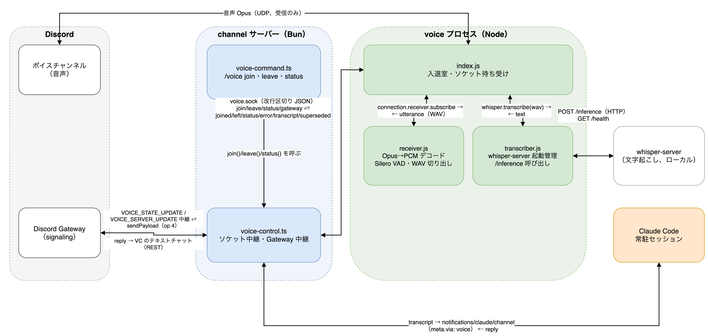
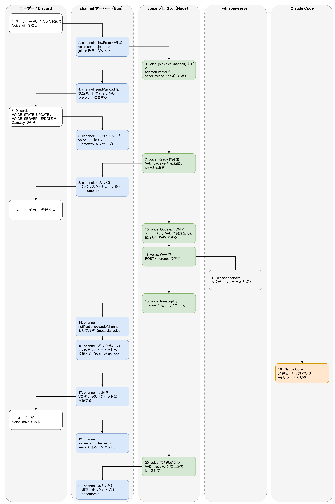

# 仕組み

## /clear の流れ


- `/clear` はターン実行中でもキューされ、ターン終了直後に実行されます。プロセスと MCP 接続は残り、セッション ID だけ変わります
- 手動でターミナルから `/clear` した場合はマーカーが無いので通知しません。10 分より古いマーカーも無視します
- 送り先の特定は `CLAUDE_PID` → その TTY → 同じ TTY を持つ tmux ペイン、の順です。tmux の外では NG を返します

## Bot ステータス


`channel/presence.ts` が、channel サーバーを起動した Claude Code 本体の PID を親プロセスをたどって特定し、
その PID を `_claude_pid` に持つステータスラインのダンプを 20 秒ごとに読んでアクティビティを更新します
（見つからなければ、生きているセッションの最新のダンプを使います）。ctx 80% 以上で取り込み中（赤）、
対象が無ければ退席中（黄）です。
Bot が送れるアクティビティのフィールドは name / type / state / url だけです。`DISCORD_PRESENCE_MODE` で
playing（既定）/ watching / listening / competing / custom を選べます（custom は吹き出し表示で狭い）。

## スラッシュコマンド


channel サーバーは起動時に、Bot が参加している各サーバーへスラッシュコマンドを登録します（ギルドコマンドなので即時反映）。
定義は `channel/commands.json`（同梱: `/ctx`、`/clear`、`/model`、`/effort`）と、`~/.claude/discord-bot/commands.json`（追加分）を合わせたものです。
ワークスペース固有のコマンドは追加分のファイルに書きます。同名なら追加分が勝ちます。

```js
[
  {
    "name": "task",
    "description": "タスク台帳を操作する",
    "skill": "/task-memo",
    "options": [
      { "name": "text", "description": "操作と内容（例: 追加 明日〇〇する）", "required": true }
    ]
  }
]
```

コマンドを受けると、送信者が allowlist に居ることと送信先が受信設定済みのチャンネル（または DM）であることを確認し、
3 秒以内に「受け付けたよ」を本人にだけ見える形で返してから、`<skill> <引数...>` の 1 行を Claude に渡します
（例: `/discord-bot:ctx`、`/task-memo 追加 明日〇〇する`）。Claude はそれをスキル呼び出しとして実行し、結果を
通常のメッセージとしてチャンネルに投稿します。登録には Bot の招待時に `applications.commands` スコープが必要で、
無い場合は起動ログに再認可用の URL が出ます。`DISCORD_SLASH_COMMANDS=off` で登録を止められます。

### サーバー側で処理するコマンド（action）

定義に `skill` ではなく `action` を書いたコマンドは、Claude に渡さず channel サーバー自身が処理します
（`channel/session-control.ts`、`/voice` だけ `channel/voice-command.ts`）。Claude のターンを使わないので、
Claude が長い作業の途中でも即座に効きます。
`action` は同梱の `model`・`effort`・`restart`・`voice` だけで、追加分の `commands.json` からも同名で上書きできます。

```js
[
  {
    "name": "effort",
    "description": "Claude の思考の深さ（effort）を切り替える",
    "action": "effort",
    "options": [
      { "name": "level", "description": "low / medium / high / xhigh / max / auto", "required": true }
    ]
  }
]
```

### /model と /effort の流れ


`/clear` と同じ「claude の PID → その TTY → 同じ TTY を持つ tmux ペイン」でペインを特定し、そこへ
`/model <alias>` や `/effort <level>` を打ち込みます。違うのは、送るのが Claude ではなく channel サーバーだという点です。
図の 2〜5 が channel サーバーの内部処理、6〜7 が Claude 側の反映、8 が切り替わり検知です。

- 引数を検証します（図の 2）。model は `best` `fable` `opus` `sonnet` `haiku` `sonnet[1m]` `opus[1m]` `opusplan` か
  `claude-` で始まる完全なモデル ID、effort は `low` `medium` `high` `xhigh` `max` `auto` です。
  無効な値は何も送らず、依頼した本人にだけ見える形で理由と有効な一覧を返します
- ペインを特定できなければ（図の 3）、同じく本人にだけ見える形で NG を返します（tmux の外では送れません）
- ステータスラインのダンプから現在値を控えてから送信し（図の 3〜4）、「/model sonnet を送ったよ（今は Fable 5.1 / effort high）。
  次のメッセージから切り替わるよ」と返します（図の 5）。スラッシュコマンドはターン実行中でもキューされ、ターン終了直後に実行されます（図の 6）
- 送信後は 2 秒おきに最大 90 秒ダンプを読み直し（図の 8）、送信時刻より新しい更新で `model.id` / `model.display_name` /
  `effort.level` が変わったら「モデルを Sonnet 5 に切り替えたよ（effort high）」を依頼元のチャンネルへ投稿します。
  検知できないままタイムアウトしたときは何も投稿せず、標準エラーにログを残すだけです（検知できなくても切り替わりは効いています）

- `/model <alias>` の引数指定は「切り替えてデフォルトとして保存」する挙動（ピッカーの Enter 相当）です。
  セッション限定にする指定方法が無いため、ターミナルで新しく開くセッションのデフォルトモデルも変わります
- `effort` の `low`〜`xhigh` はモデルごとに保存され、`max` はセッション限り、`auto` は保存済みの設定をクリアします

### /restart の流れ


Claude Code のバージョンを上げるには、常駐セッションを新しいバイナリで立ち上げ直す必要があります。ただし claude が終了すると
その子プロセスである channel サーバーも一緒に死ぬので、終了待ちから起動し直しまでは外に出した補助スクリプトが担当します。
図のレーンは、再起動前のセッション（1〜5）、claude の外で動く補助スクリプト（6〜8）、再起動後の新しいセッション（9〜10）です。

- channel サーバーはペインを特定し、ステータスラインのダンプから `session_id` と `cwd` を取ります（図の 2）
  （ダンプが無ければ `lsof -a -p <pid> -d cwd -Fn` で cwd を取ります）
- 補助スクリプト `scripts/restart-helper.sh` を、`Bun.spawn` の `detached`（POSIX では `setsid` 相当）と `unref()` で
  親から切り離して起動します（図の 3）。引数は環境変数で渡し、標準出力・標準エラーは `~/.claude/discord-bot/restart.log` へ追記します
- 「再起動するね」を返してから 1 秒待って、ペインへ `/exit` を送ります（図の 4）。先に `/exit` を送ると、
  返事が Discord に届く前に claude ごと channel サーバーが落ちてしまうためです（claude と channel サーバーの終了が図の 5）
- 補助スクリプトは 1 秒おきに `kill -0` で claude の終了を待ちます（図の 6）。90 秒たっても終わらなければ `C-c` と `/exit` を送り直し、
  180 秒で諦めて「claude が終了しないので再起動を中止したよ」を Discord REST で投稿して終わります
- claude が終わったら `claude update` を実行します（図の 7。180 秒で打ち切り。終了コードの意味が公開されていないので、
  失敗しても起動し直しへ進みます）。前後の `claude --version` を控えます
- `~/.claude/discord-bot/restart-done.json` に依頼元のチャンネル・前後のバージョン・引き継ぎの有無・依頼時刻を書き、
  元の cwd で `scripts/start-discord.sh` を実行します（図の 8）。tmux セッションを作るか新しいウィンドウにするかはランチャーが判断します（図の 9）
- 起動し直した channel サーバーが ready 時に `notifyRestartDone()` でマーカーを読んで消し（図の 10）、
  「再起動したよ（2.1.261 → 2.1.262）。ここからは新しいセッションで応対するね」を依頼元へ投稿します

- 既定では会話を引き継ぎません。`/restart resume:yes` のときだけ `--resume <session_id>` を付けて起動し直します
- ターミナルで `/exit` したときは補助スクリプトが動いていないので、そのまま終了してウィンドウが閉じます（今までどおり）
- 取り残し対策として、完了通知は 10 分より古いマーカーを無視します（消すだけで投稿しません）

## 音声の流れ

音声入力（聞き取りのみ、読み上げは未対応）の全体像。





### channel（Bun）と voice（Node）の分担

`@discordjs/voice` が Bun で動かないため、ボイスチャンネルへの入退室と音声受信は別プロセス `voice/`（Node）に
切り出してある。voice プロセスは Gateway 接続を持たない（トークンも持たない）。channel サーバーが張っている
Gateway 1 本を Unix ドメインソケット `~/.claude/discord-bot/voice.sock` 越しに借りる形にしてある。
channel 側の中継は `channel/voice-control.ts`、`/voice` コマンドの処理は `channel/voice-command.ts` が担う。

voice プロセスの起動は `/voice join` が呼ばれたときだけ行われる。channel サーバー起動時には何もしない。
起動は `voice-control.ts` が `node voice/index.js` を detached で spawn し、標準出力・標準エラーは
`~/.claude/discord-bot/voice.log` にリダイレクトする。

### ソケットのプロトコル

改行区切りの JSON を 1 行 1 メッセージとしてやりとりする。voice 側が listen し、channel 側が繋ぎに行く。

channel → voice

- `join` / `leave` / `status`（`requestId` 付き。応答はこれで突き合わせる）
- `gateway`（Bot 自身の `VOICE_STATE_UPDATE` と `VOICE_SERVER_UPDATE` をそのまま中継）

voice → channel

- `sendPayload`（op 4。channel が該当ギルドの shard へ送る）
- `joined` / `left` / `status` / `error`（要求への応答）
- `transcript`（発話の文字起こし。要求に紐づかない）
- `superseded`（新しい channel サーバーに接続が置き換わったことの通知）

voice は最後に繋いだクライアントを正として扱い、新しいクライアントが繋いだら古いソケットに
`superseded` を送ってから `end()` する（`/restart` で新旧 channel が重なる期間の混線防止。受け取った側は
次の `join()` まで自動再接続しない）。

### Gateway 中継

`/voice join` を受けると、channel は voice へ `join` を送る。voice は `@discordjs/voice` の
adapterCreator から受け取った op 4（Voice State Update）を `sendPayload` として channel へ返し、
channel は該当ギルドの shard へ実際に送信する。Discord から返ってくる `VOICE_STATE_UPDATE` と
`VOICE_SERVER_UPDATE` は channel の `client.on('raw', ...)` で受け（Bot 自身のものだけを選別する）、
`gateway` メッセージとして voice へ中継する。voice はこの 2 つを adapter に渡し、Ready に到達すると
`joined` を channel へ返す。

### VAD の終端 2 系統

発話区間の検出（`voice/receiver.js`）は、話者ごとに `EndBehaviorType.Manual` で購読を開き、
閉じるタイミングを 2 系統で判定する。

- `silence-vad` — データは届き続けているが、Silero VAD が `silenceMs`（既定 700ms）分ずっと
  「発話でない」と判定し続けた場合。購読は閉じない（データがまだ来る可能性があるため、バッファと
  VAD の内部状態だけリセットして同じ購読のまま次の発話を受け続ける）
- `silence-nodata` — 相手のクライアントが送信そのものを止め、データが `silenceMs` の間 1 バイトも
  届かない場合（壁時計ベースの watchdog タイマーで検出する）。この場合だけ購読を閉じてよい

Discord の `speaking` の `end` イベントは使わない。日本語の間投詞程度の間（0.5 秒前後）で on/off が
揺れることがあるため、Manual 購読はその間も開いたままにしておく。

### whisper-server の起動管理

文字起こしはローカルの whisper.cpp（`whisper-server` 常駐 + 発話ごとに `POST /inference`）。
`voice/transcriber.js` が voice プロセス起動時と各 `join` のたびに疎通確認（`GET /health`）し、
応答が無ければ `spawn` で起動する。既に動いていたものは「自分のものではない」扱いにして、
voice プロセス終了時にも止めない。落ちたら 1 回だけ再起動を試み、それでも駄目なら `down` のまま
次の `join` を待つ。実測の所要時間は発話の長さ（1.6 / 7 / 12 秒）に関わらず約 2.5 秒
（whisper が 30 秒枠で処理するため）。

### 返事の行き先

文字起こし結果（`transcript`）は voice から channel へソケットで送られ、channel は
`notifications/claude/channel` として Claude へ渡す（`meta.via: 'voice'`）。Claude が reply ツールを
呼ぶと、返事は Bot が入室中のボイスチャンネルに付属するテキストチャットへ通常のメッセージとして
投稿される。文字起こしの対象は `access.allowFrom` に載っているユーザーだけで、対象外のユーザーの
発話は channel 側で捨てられる。

文字起こしが完成すると、Claude への通知と同時に `🎤 <表示名>: <文字起こし>` の形でその場のボイス
チャンネルのテキストチャットにも投稿される。何を聞き取ったかをその場で確認できるようにするためで、
`access.json` の `voiceEcho: false` で無効化できる。

### /voice コマンド

`/voice join`・`/voice leave`・`/voice status` は action 方式（下の「サーバー側で処理するコマンド
（action）」の一覧に `voice` が加わる。Claude のターンを使わず channel サーバー自身が処理する）。

- `/voice join` — 呼び出し元が今いるボイスチャンネルへ入室する。voice プロセスが未起動なら起動する
- `/voice leave` — 退室する
- `/voice status` — 入室状態と whisper の状態（`ready` / `starting` / `down`）を確認する

いずれも `deferReply` → `editReply` で本人にだけ返す（voice プロセスとの往復に最大 30 秒かかるため）。

## サーバー管理 MCP

`mcp/server-admin/` は Python（FastMCP + httpx）の MCP サーバーで、Discord REST API v10 を直接呼びます。
ツールは list_channels / create_channel / create_category / edit_channel / delete_channel /
create_forum_thread / list_threads / close_thread / reopen_thread の 9 つです。
Claude から見たツール名は `mcp__plugin_discord-bot_server-admin__<tool>` になります。
`create_channel` の直後には `hooks/remind-channel-access.py` が「access.json に受信設定を入れる」ことを促す注意書きを注入します。
`requireMention` が `true` のままだとメンション無しの投稿が届かない、という公式プラグインの落とし穴を塞ぐためです。

## 制約と注意

- Discord セッションは tmux の中で動かす前提です。tmux の外やリモート（SDK）セッションでは `/clear` `/model` `/effort` `/restart` を送れず、その旨を Discord に返します
- `--channels` 付きの claude を 2 つ立てると Discord に二重返信します。ランチャーは検出して止めますが、手で起動するときは注意してください
- Bot のステータスをプログラムから読み取るには Developer Portal で Presence Intent を有効にする必要があります（設定するだけなら不要）。`scripts/discord_presence_check.py` は確認用です
- `/compact` は対象外です。同じ仕組みで送れますが、要約中に Discord 側が無音になるので用意していません
- 音声入力は聞き取りのみで、読み上げ（音声合成）には対応していません。返事は常にテキストです
- `/restart` すると voice プロセスと Gateway の接続が切れ、ボイスチャンネルから外れます（Discord は
  Gateway セッションが切れると Bot を通話から外すため）。自動再入室はしないので、`/restart` のあとは
  `/voice join` を打ち直してください
- 1 発話あたり約 2.5 秒の遅延があります（whisper-server が発話を受け取ってから文字になるまで）。
  喋り終えてから 2〜3 秒後に文字になる感覚です
- Discord の音声受信（`@discordjs/voice` でのボイスチャンネル参加・受信）は公式にサポートされた
  領域ではありません。Discord 側の仕様変更で壊れる可能性があります
- 入室が間欠的に `Ready` に到達しないことがあります。`voice.json` の `voice.readyTimeoutS`（既定 8 秒）で
  1 回だけ自動的に接続をやり直しますが（合計最大 16 秒。#73）、それでも失敗したらもう一度 `/voice join` を打ってください

## channel プラグインの承認リスト

Claude Code は `--channels` に渡された channel プラグインを承認リスト（Anthropic 側の設定 `tengu_harbor_ledger`、
`{plugin, marketplace}` の配列）と突き合わせ、載っていなければ「not on the approved channels allowlist」として
通知を捨てます。公式の `discord@claude-plugins-official` は載っていますが、フォークしたこのプラグインは載っていません。

回避策は 2 つあります。

- 管理者設定 `allowedChannelPlugins` に同じ形式で書く（README のセットアップ 4）。管理者設定が承認リストの代わりになります
- `--dangerously-load-development-channels plugin:discord-bot@ryuki-plugins` を付けて起動する。起動時に
  「WARNING: Loading development channels」の確認が出て、承認すると読み込まれます。ただし 2026-09-03 の検証では
  この環境（Claude Max、macOS、tmux）で確認ダイアログが出ずフラグが無視されました。同じ症状が
  anthropics/claude-code#82939 で報告されています。
  `--channels` と両方に同じプラグインを渡すと `--channels` 側で判定されて弾かれるので、付けるなら開発フラグだけにします
